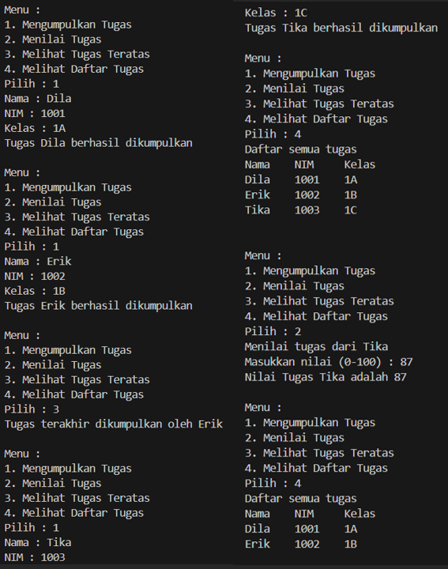
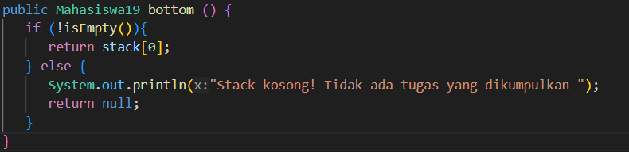
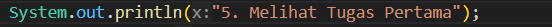
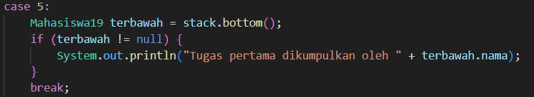
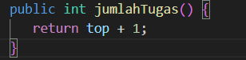
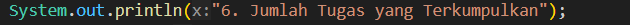
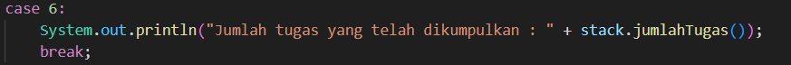
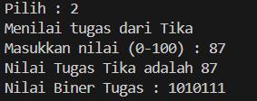

|  | Algoritma dan Struktur Data |
|--|--|
|NIM  | 244107020034  |
|Nama | Nadya Aurora Gebi Agista |
|Kelas | TI - 1H |
|Repository| [link!] (https://github.com/Nadyaaurora/coolyeah)

# JOBSHEET 10 STACK
## PRAKTIKUM
## 2.1 Percobaan 1: Mahasiswa Mengumpulkan Tugas
### 2.1.2 Verifikasi Hasil Percobaan


### 2.1.3 Pertanyaan
1. Yang harus diperbaiki adalah bagian class StackTugasMahasiswa19.java ---> method print()
	```java
	public void print() {
		for (int i = top; i >= 0; i--) {
			System.out.println(stack[i].nama + "\t" + stack[i].nim + "\t" + stack[i].kelas);
		}
		System.out.println("");
	}
	```

2.  Stack dapat menampung 5 data tugas mahasiswa, karena saat objek StackTugasMahasiswa dibuat, nilai kapasitas ditentukan di dalam parameter.

3. Karena untuk menghindari overflow, yaitu kondisi saat stack sudah penuh tapi masih mencoba menambahkan data baru. Kalau pengecekan `!isFull()` dihapus, program bisa menulis di luar batas array dan menyebabkan error.
4. Modifikasi kode program pada class `MahasiswaDemo19` dan `StackTugasMahasiswa19`
	- menambah method di class`StackTugasMahasiswa19`
	  	

	- menambah case di class `MahasiswaDemo19`

	  

	  

5. Menambahkan method di class `StackTugasMahasiswa19` untuk menghitung berapa banyak tugas yang telah dikumpulkan
   

   Menambah case di class `MahasiswaDemo19`

   

   

6. Commit dan push ke github
   [link!](https://github.com/Nadyaaurora/coolyeah/tree/main/SMT.%202/ALSD/WEEK%2010)

## 2.2 Percobaan 2: Konversi Nilai Tugas ke Biner 
### 2.2.2 Verifikasi Hasil Percobaan


### 2.2.3 Pertanyaan
1. Method ini mengubah angka desimal menjadi biner dengan cara membagi angka tersebut dengan 2 secara berulang, lalu menyimpan sisa pembagiannya (0 atau 1) ke dalam stack. Stack digunakan agar urutan hasil bisa dibalik, karena proses konversi desimal ke biner dimulai dari bawah ke atas. Setelah proses pembagian selesai, semua sisa diambil dari stack dan digabungkan menjadi string biner sebagai hasil akhir.

2. Program akan error karena variabel `kode` tidak pernah dibuat atau dikenali. Seharusnya tetap menggunakan `nilai`, karena variabel itulah yang menyimpan angka desimal yang akan dikonversi. Mengubahnya menjadi `kode` tanpa deklarasi akan menyebabkan kesalahan saat kompilasi.

## 2.4 Latihan Praktikum
Solusi ini diimplementasikan dalam tiga class `Surat19.java`, `StackSurat.java`, dan `SuratDemo19.java` dan berikut adalah contoh hasil output program :

.png)

.png)

Langkah-langkah utama dalam program ini:
1. Menginput surat izin mahasiswa (id surat, nama, kelas, jenis izin, durasi).
2. Menyimpan data surat ke dalam stack dengan kapasitas tertentu.
3. Menampilkan surat izin terakhir yang masuk (top of stack).
4. Memproses atau memverifikasi surat izin (menghapus dari stack).
5. Melakukan pencarian surat izin berdasarkan nama mahasiswa.


