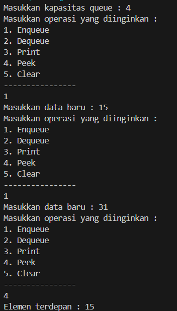

|  | Algoritma dan Struktur Data |
|--|--|
|NIM  | 244107020034  |
|Nama | Nadya Aurora Gebi Agista |
|Kelas | TI - 1H |
|Repository| [link!] (https://github.com/Nadyaaurora/coolyeah)

# JOBSHEET 11 QUEUE
## PRAKTIKUM
## 2.1 Percobaan 1 : Operasi Dasar QueueMengumpulkan Tugas
### 2.1.2. Verifikasi Hasil Percobaan

### 2.1.3 Pertanyaan
1. Saat queue baru dibuat, belum ada data yang masuk. Supaya jelas kalau antrian masih kosong, front dan rear diberi nilai -1 karena belum menunjuk ke posisi mana pun di dalam array. Sedangkan size diset ke 0 karena memang belum ada elemen di dalam queue.
2. Bagian kode itu berfungsi untuk mengatur agar rear kembali ke posisi awal (indeks 0) kalau sudah berada di posisi paling akhir array (max - 1). Tujuannya supaya antrian bisa berputar atau berulang dari awal array lagi, sesuai konsep circular queue. Jadi, ruang kosong di awal array bisa dimanfaatkan kembali untuk menampung data baru.
3. Potongan kode tersebut digunakan untuk mengatur agar front kembali ke indeks 0 saat posisinya sudah mencapai ujung array (max - 1). Ini mendukung sistem antrian melingkar (circular queue), sehingga setelah elemen terakhir di-dequeue, pengambilan data selanjutnya bisa dilanjutkan dari awal array.
4. Nilai front tidak selalu dimulai dari indeks 0 karena saat terjadi operasi dequeue, posisi front akan bergeser. Misalnya, jika satu elemen telah dikeluarkan, maka front akan berada di indeks 1. Oleh karena itu, perulangan saat mencetak isi queue harus dimulai dari front, supaya hanya menampilkan data yang masih ada di dalam antrian, bukan dari indeks awal array yang mungkin sudah kosong.
5. Potongan kode `i = (i + 1) % max` digunakan untuk menerapkan konsep circular queue. Dengan rumus ini, jika nilai `i` sudah berada di posisi terakhir array (indeks `max - 1`), maka saat ditambah 1, nilainya akan kembali ke 0. Hal ini memungkinkan proses pencetakan (print) data bisa melanjutkan dari awal array lagi jika diperlukan, tanpa keluar dari batas indeks yang tersedia.
6. Potongan kode program yang merupakan queue overflow!

    

7. Memodifikasi `switch` di `QueueMain` dengan menambahkan pengecekan penuh sebelum `enqueue` dan kosong sebelum `dequeue`. Jika kondisi penuh atau kosong terpenuhi, program langsung dihentikan menggunakan `return`.

    

    .png)

## 2.2 Percobaan 2: Konversi Nilai Tugas ke Biner 
### 2.2.2 Verifikasi Hasil Percobaan

.png)

.png)

### 2.2.3 Pertanyaan
Lakukan modifikasi program dengan menambahkan method baru bernama LihatAkhir pada class AntrianLayanan yang digunakan untuk mengecek antrian yang berada di posisi belakang. Tambahkan pula daftar menu 6. Cek Antrian paling belakang pada class LayananAkademikSIAKAD sehingga method LihatAkhir dapat dipanggil!
- Menambahkan menu

    .png)

    

- Menambahkan method

    

-Hasil Run

## 2.4 Latihan Praktikum
Solusi ini diimplementasikan dalam dua class: `AntrianKRS` dan `LayananKRSMain` dan berikut adalah contoh hasil output program :

.png)

.png)

.png)

.png)

.png)

Langkah-langkah utama dalam program ini:
1. Menyimpan data mahasiswa dalam antrian dengan kapasitas maksimal 10 menggunakan konsep circular queue.
2. Menambah mahasiswa ke antrian jika belum penuh dan kuota KRS (30 mahasiswa) belum terpenuhi.
3. Melayani dua mahasiswa terdepan sekaligus dari antrian dan menandai mereka sudah KRS.
4. Menampilkan dua mahasiswa terdepan, seluruh antrian, atau mahasiswa terakhir dalam antrian.
5. Menampilkan jumlah mahasiswa yang antre, sudah KRS, dan belum KRS.
6. Mengosongkan antrian jika diperlukan.
7. Semua fungsi dijalankan melalui menu interaktif di program utama (`LayananKRSMain`).

