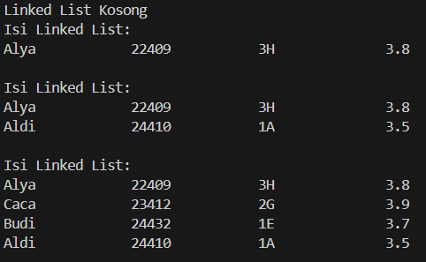
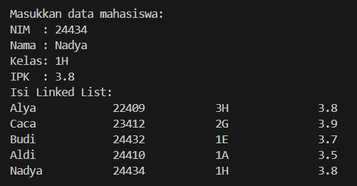
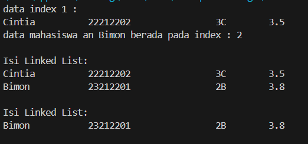
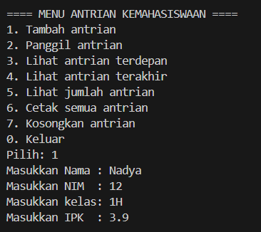
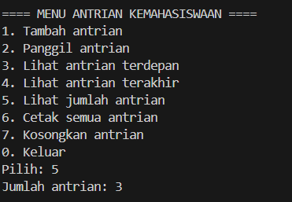
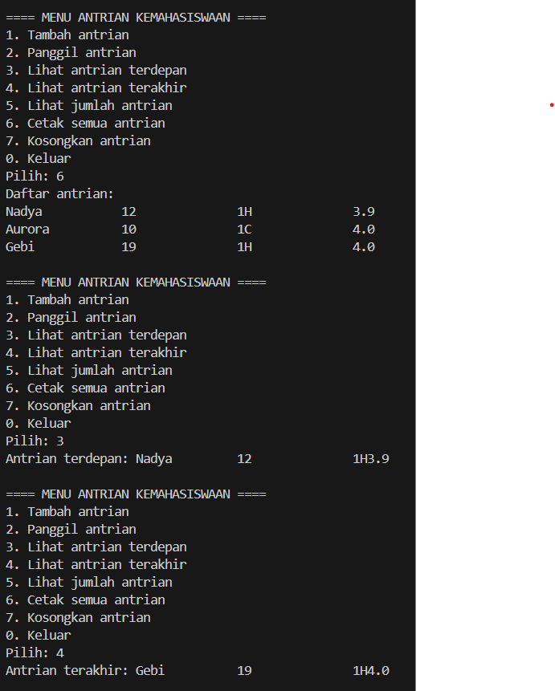
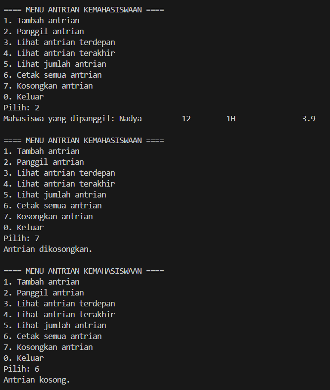

|  | Algoritma dan Struktur Data |
|--|--|
|NIM  | 244107020034  |
|Nama | Nadya Aurora Gebi Agista |
|Kelas | TI - 1H |
|Repository| [link!] (https://github.com/Nadyaaurora/coolyeah)

# JOBSHEET 12 LINKED LIST
## PRAKTIKUM
## 2.1 Pembuatan Single Linked List
### 2.1.1 Verifikasi Hasil Percobaan

### 2.1.2 Pertanyaan
1. Karena pada saat program dijalankan, pemanggilan `sll.print();` dilakukan sebelum data apapun ditambahkan ke dalam linked list.
2. Variabel temp digunakan sebagai penunjuk yang bisa bergerak dari satu node ke node berikutnya dalam linked list. Karena head tidak boleh digeser, kita memakai temp untuk menelusuri isi linked list saat ingin mencari node tertentu, menambahkan data di tengah, atau mencetak semua data. Dengan begitu, struktur utama linked list tetap aman dan tidak berubah.
3. Lakukan modifikasi agar data dapat ditambahkan dari keyboard!
    

## 2.2 Modifikasi Elemen pada Single Linked List
### 2.2.2 Verifikasi Hasil Percobaan

### 2.2.3 Pertanyaan
1. Keyword `break` digunakan untuk menghentikan perulangan `while` setelah data yang dicari ditemukan dan dihapus dari linked list.
2. Kode `temp.next = temp.next.next;` berfungsi untuk menyambungkan node sebelum data yang ingin dihapus dengan node setelahnya. Hal ini dilakukan agar struktur linked list tetap terhubung dan tidak terputus setelah proses penghapusan data. Selanjutnya, `if (temp.next == null)` digunakan untuk mengecek apakah node yang baru saja disambungkan merupakan node terakhir (tidak memiliki sambungan ke node lain). Jika iya, maka `tail` perlu diperbarui menjadi `temp`, agar pointer `tail` tetap menunjuk ke node terakhir yang benar setelah penghapusan.

## TUGAS
Solusi ini diimplementasikan dalam 4 class: `Mahasiswa19`, `NodeMahasiswa19`, `Antrian19`, `AntrianMain19` dan berikut adalah contoh hasil output program :

Langkah-langkah utama dalam program ini:
- Menyimpan data mahasiswa yang mendaftar ke layanan unit kemahasiswaan dalam antrian berbasis _Linked List_.
- Menambahkan mahasiswa ke antrian*selama antrian belum kosong dan input valid.
- Memanggil/melayani mahasiswa dari antrian satu per satu dari antrian terdepan (_dequeue_).
- Menampilkan mahasiswa paling depan dan paling belakang dari antrian.
- Menampilkan jumlah mahasiswa yang sedang mengantre dalam antrian.
- Menampilkan seluruh isi antrian mahasiswa secara berurutan.
- Mengosongkan seluruh isi antrian bila dibutuhkan.    
- Semua operasi diakses melalui menu interaktif di program utama (`AntrianMain19`).

