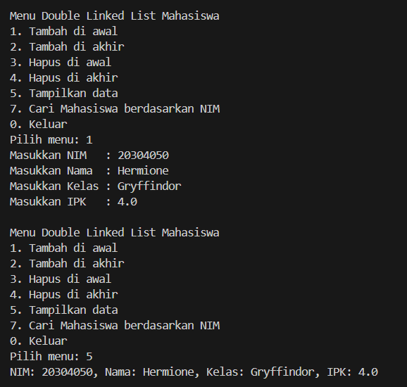
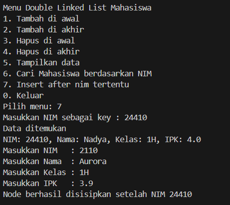
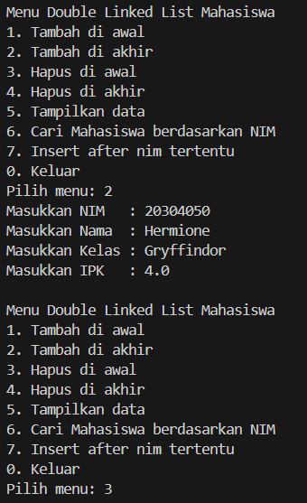
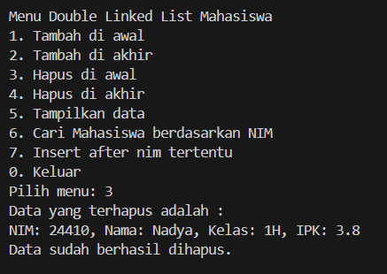
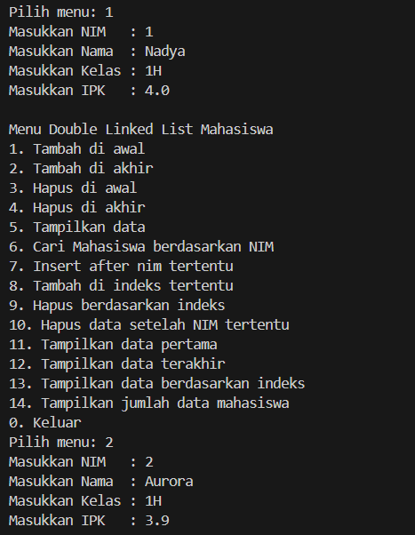
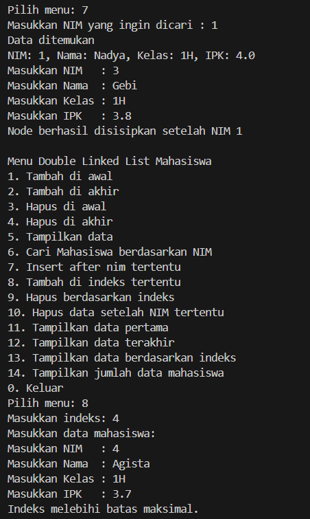
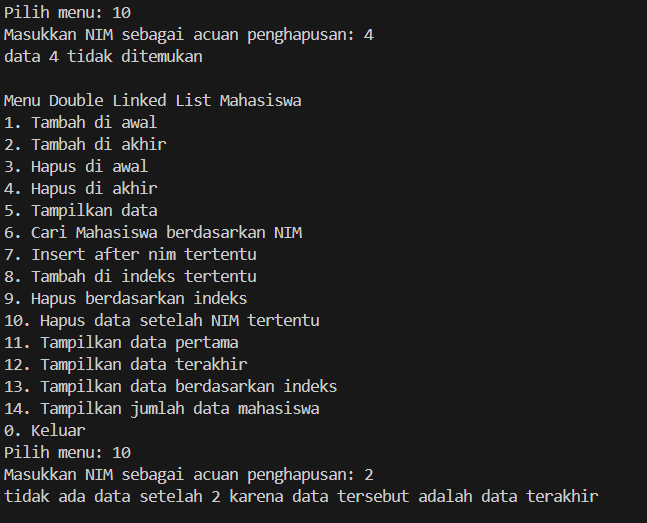
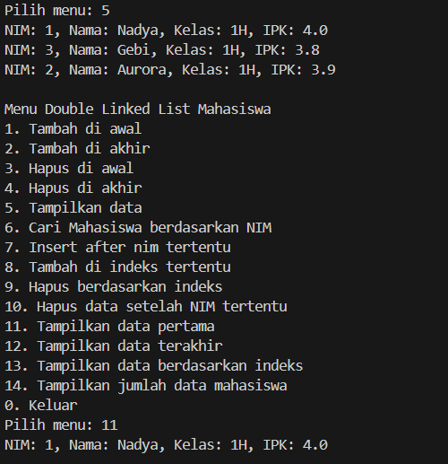
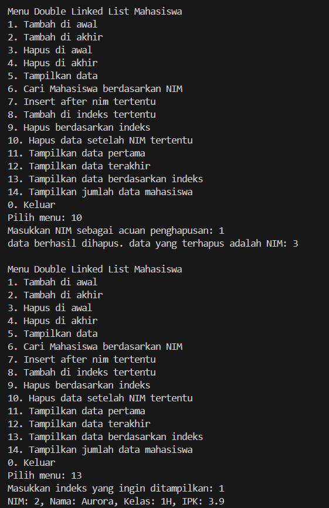
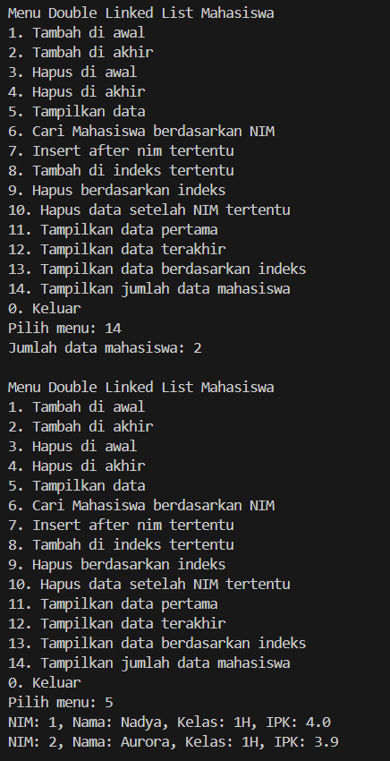

|  | Algoritma dan Struktur Data |
|--|--|
|NIM  | 244107020034  |
|Nama | Nadya Aurora Gebi Agista |
|Kelas | TI - 1H |
|Repository| [link!] (https://github.com/Nadyaaurora/coolyeah)

# JOBSHEET 13 DOUBLE LINKED LIST
## PRAKTIKUM
## 12.2.1 Percobaan 1
### 12.2.2 Verifikasi Hasil Percobaan


### 12.2.3 Pertanyaan Percobaan
1. - Single Linked List hanya memiliki satu arah, setiap node hanya menyimpan referensi ke node berikutnya (`next`).    
    - Double Linked List memiliki dua arah, setiap node menyimpan referensi ke node sebelumnya (`prev`) dan node berikutnya (`next`), sehingga traversal bisa dua arah (maju dan mundur).
2. - `next`: menunjuk ke node berikutnya di dalam list.    
    - `prev`: menunjuk ke node sebelumnya. Berguna agar traversal dapat dilakukan ke arah belakang juga.
3. Untuk menginisialisasi objek dengan `head` dan `tail` bernilai `null`, menandakan bahwa list masih kosong saat pertama kali dibuat.
4. Jika list kosong, node baru menjadi `head` sekaligus `tail`. Tapi, jika tidak kosong, node baru akan menjadi head dan menghubungkan ke node sebelumnya (`head.prev = newNode`).
5. Menghubungkan node lama (`head`) ke node baru di depannya (`newNode`) melalui pointer `prev`.
6. Ditambahkan untuk pengecekan melalui 
    ```java
    if (isEmpty()) {
        System.out.println("Linked List masih kosong.");
    } else {
    }
    ```
7. newNode akan dimasukkan setelah node current, sehingga kode current.next.prev = newNode; digunakan untuk menyambungkan pointer prev dari node setelah current (current.next) ke newNode.
8. Modifikasi menu pilihan dan switch-case agar fungsi insertAfter() masuk ke dalam menu pilihan dan dapat berjalan dengan baik.
    - Memodifikasi class DLLMain.java
        

## 12.3 Kegiatan Praktikum 2
### 12.3.2 Verifikasi Hasil Percobaan


### 12.3.3 Pertanyaan Percobaan
1. Kode `head = head.next;` berfungsi untuk memindahkan posisi head ke node berikutnya karena node pertama akan dihapus. Setelah head pindah, kita perlu memutus hubungan ke node sebelumnya agar tidak bisa diakses lagi, jadi `head.prev = null;` digunakan untuk memutus koneksi tersebut. Dengan begitu, node lama yang tadinya di awal list benar-benar terlepas dari daftar dan siap dihapus oleh sistem.
2. Modifikasi kode program untuk menampilkan pesan “Data sudah berhasil dihapus. Data yang terhapus adalah … “
    - Memodifikasi clas DoubleLinkedList01.java 
        

## TUGAS
Solusi ini diimplementasikan dalam dua class: `DoubleLinkedList01`, `DLLMain` dan berikut adalah contoh hasil output program :













Langkah-langkah utama dalam program ini:
1.  Menyimpan data mahasiswa ke dalam struktur Double Linked List, yang memungkinkan akses dari dua arah (maju dan mundur).
2.  Menambahkan data mahasiswa di awal, akhir, setelah NIM tertentu, atau pada indeks tertentu.    
3.  Menghapus data mahasiswa dari awal, akhir, setelah NIM tertentu, atau berdasarkan indeks.    
4.  Mencari mahasiswa berdasarkan NIM menggunakan method `search()`.   
5.  Menampilkan semua data mahasiswa secara berurutan dari depan ke belakang.   
6.  Menampilkan data mahasiswa pertama dan terakhir di list.    
7.  Mengakses data berdasarkan indeks tertentu dengan `getByIndex()`.    
8.  Menampilkan jumlah total data mahasiswa dalam list dengan `size()`.    
9.  Seluruh operasi dilakukan melalui menu interaktif di program utama `DLLMain`.