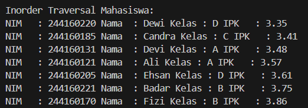
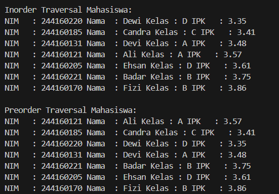

|  | Algoritma dan Struktur Data |
|--|--|
|NIM  | 244107020034  |
|Nama | Nadya Aurora Gebi Agista |
|Kelas | TI - 1H |
|Repository| [link!] (https://github.com/Nadyaaurora/coolyeah)

# JOBSHEET 14 TREE
## 14.2 Kegiatan Praktikum 1 Implementasi Binary Search Tree menggunakan Linked List
## 14.2.1 Percobaan 1
### Verifikasi Hasil Percobaan
.png)

.png)

### 14.2.2 Pertanyaan Percobaan
1. Karena pada BST, data disusun terurut (left child < root < right child), sehingga pencarian bisa dilakukan lebih cepat dengan membandingkan nilai dan hanya menyusuri satu sisi subtree dengan aturannya dimana left child harus lebih kecil daripada right child
2. Atribut left untuk pointer ke anak kiri dari node, sedangkan atribut right untuk pointer ke anak kanan dari node
3. a. Untuk apakah kegunaan dari atribut root di dalam class BinaryTree? 
		- Kegunaan atribut root adalah untuk menandai node paling atas dalam struktur binary tree, yang menjadi induk dari semua node lainnya dan menjadi titik awal dalam proses traversal, pencarian, penambahan, dan penghapusan data.
        
	b. Ketika objek tree pertama kali dibuat, apakah nilai dari root?
		- Saat objek tree pertama kali dibuat, nilai dari root adalah null karena belum ada data yang dimasukkan ke dalam tree. Nilai root baru akan terisi ketika node pertama ditambahkan, dan node itu akan menjadi akar dari tree tersebut.
4. Ketika tree masih kosong, artinya nilai root masih null. Saat sebuah node baru akan ditambahkan, node tersebut akan langsung ditempatkan sebagai root, karena belum ada node lain dalam tree. Node ini akan menjadi titik awal atau akar dari seluruh struktur binary tree
5. Pertama, pada kode tersebut kita membuat variabel parent dari nilai current, sehingga kita bisa menyimpan node induk dari node yang sedang diakses. Setelah itu dilakukan pengkondisian: apabila mahasiswa.ipk yang ingin ditambahkan lebih kecil daripada ipk dari mahasiswa pada node current, maka current diperbarui menjadi current.left. Kemudian dicek apakah current sekarang bernilai null. Jika ya, maka parent.left akan dihubungkan dengan newNode sehingga node baru ini menjadi anak kiri dari parent. Namun jika mahasiswa.ipk yang akan ditambahkan lebih besar daripada ipk pada node current, maka current diperbarui menjadi current.right. Setelah itu dilakukan pengecekan apakah current bernilai null. Jika ya, maka parent.right akan dihubungkan dengan newNode sehingga node baru menjadi anak kanan dari parent.
6. Method getSuccessor digunakan untuk mendapatkan node dengan nilai IPK terkecil dari subtree sebelah kanan dari parameter del. Pada method delete, saat memanggil method ini, nilai current dikirim sebagai parameter del. Node hasil return dari getSuccessor akan digunakan sebagai pengganti node current yang akan dihapus. Hal ini dilakukan agar struktur binary search tree tetap terjaga, yaitu dengan tetap memenuhi aturan left < parent < right

## 14.3 Kegiatan Praktikum 2
## Implementasi Binary Tree dengan Array 
### Verifikasi Hasil Percobaan

### 14.3.2 Pertanyaan Percobaan
1. Atribut data digunakan untuk menyimpan elemen-elemen dari binary tree dalam bentuk array, sedangkan idxLast digunakan untuk menandai indeks terakhir yang terisi dalam array. Ini membantu dalam mengetahui batas data yang valid di dalam tree.
2. Method populateData digunakan untuk menambahkan data mahasiswa ke dalam array dan mengatur nilai idxLast sesuai jumlah data yang dimasukkan ke binary tree
3. Method traverseInOrder() digunakan untuk menelusuri dan menampilkan data dari binary tree dengan urutan in-order, yaitu: anak kiri → node induk → anak kanan. Ini berguna untuk menampilkan data yang sudah tersusun secara berurutan dari yang terkecil ke terbesar.
4. Left child = 2 × 2 + 1 = 5  
Right child = 2 × 2 + 2 = 6  
Jadi, anak kiri dari node pada indeks 2 akan ditempatkan di array pada indeks 5, dan anak kanannya akan ditempatkan pada indeks 6
5. Statement int idxLast = 6 digunakan untuk menentukan bahwa data terakhir yang valid atau terisi dalam array berada pada indeks ke-6. Nilai ini penting agar traversal tidak membaca elemen di luar batas data yang diinputkan.
6. Rumus 2 × idxStart + 1 dan 2 × idxStart + 2 digunakan agar posisi anak kiri dan kanan dalam array tetap sesuai dengan struktur pohon biner. Dengan rumus ini, data yang lebih kecil bisa otomatis tersimpan di indeks sebelah kiri dan data yang lebih besar di sebelah kanan, mengikuti aturan binary search tree. Hal ini menjaga agar susunan tree dalam array tetap teratur dan tidak membingungkan saat traversal

## 14.4 Tugas Praktikum
Solusi ini diimplementasikan dalam dua class utama:
1.  BinaryTree19 dan BinaryTreeMain19 untuk struktur Binary Search Tree (menggunakan Linked List)
2.  BinaryTreeArray19 dan BinaryTreeArrayMain19 untuk struktur Binary Tree (menggunakan Array)
    
Berikut adalah hasil output program:
**Contoh Output Binary Tree (Linked List):**

  .png)
  
  .png)

**Contoh Output Binary Tree (Array):**

  

----------

### Langkah-langkah utama dalam program:

**1. Binary Search Tree (Linked List)**

- Menyimpan data mahasiswa ke dalam struktur Binary Search Tree menggunakan class Node19 dan BinaryTree19
- Menambahkan data mahasiswa berdasarkan IPK menggunakan method add dan addRekursif
- Menampilkan data secara in-order, pre-order, dan post-order
- Mencari mahasiswa berdasarkan IPK menggunakan method find
- Menghapus data mahasiswa menggunakan method delete untuk semua kasus (0, 1, atau 2 anak)
- Menampilkan data mahasiswa dengan IPK paling kecil dan paling besar menggunakan method cariMinIPK dan cariMaxIPK
- Menampilkan mahasiswa dengan IPK di atas batas tertentu menggunakan method tampilMahasiswaIPKdiAtas
    

**2. Binary Tree (Array)**
- Menyimpan data mahasiswa dalam array berdasarkan struktur binary tree
- Menambahkan data ke dalam array menggunakan method add dan populateData
- Menampilkan data secara in-order dan pre-order menggunakan metode traversal berbasis indeks array
- Menggunakan rumus penentuan anak kiri dan anak kanan:
    -   Left child: 2 * idx + 1
    -   Right child: 2 * idx + 2