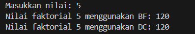
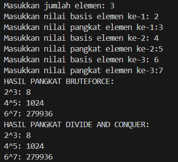
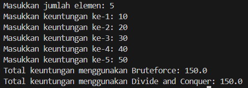
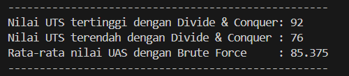

|  | Algoritma dan Struktur Data |
|--|--|
|NIM  | 244107020034  |
|Nama | Nadya Aurora Gebi Agista |
|Kelas | TI - 1H |
|Repository| [link!] (https://github.com/Nadyaaurora/coolyeah)

# JOBSHEET 5 BRUTE FORCE AND DIVIDE CONQUER

## PRAKTIKUM
### 5.2.2 Verifikasi Hasil Percobaan


### 5.2.3 Pertanyaan
1. Pada bagian if, dilakukan pengecekan apakah nilai n sama dengan 1. Jika kondisi ini terpenuhi, fungsi langsung mengembalikan nilai 1 sebagai base case untuk menghentikan rekursi. Jika tidak terpenuhi, maka eksekusi masuk ke bagian else, di mana fungsi akan memanggil dirinya sendiri dengan parameter n-1. Proses ini terus berlangsung hingga mencapai base case, sehingga hasil faktorial dapat diperoleh setelah seluruh pemanggilan rekursi selesai.
2. Memungkinkan, perulangan pada method faktorialBF() tidak harus menggunakan for saja, tapi bisa menggunakan while loop. Maka hasilnya seperti ini, jika menggunakan while loop :
    ```java
    int faktorialBF(int n){
        int fakto = 1;
        int i = 1; 
        while (i <= n) { 
            fakto *= i; 
            i++;         
        }
        return fakto;
    }
    ```
3. * fakto *= i; dilakukan dalam perulangan dari 1 hingga n dengan pendekatan brute force, di mana setiap iterasi mengalikan nilai sebelumnya dengan i.
    * fakto = n * faktorialDC(n-1);  merupakan pemanggilan rekursif, yang terus memanggil dirinya sendiri dengan parameter n-1 hingga mencapai kondisi dasar ( n == 1). Jika kondisi dasar belum terpenuhi, fungsi akan terus berjalan hingga semua pemanggilan selesai dan hasil faktorial diperoleh.

4. * `faktorialBF()` menggunakan pendekatan brute force, di mana proses perhitungan dilakukan dengan perulangan dari nilai awal hingga nilai akhir (n). Setiap iterasi mengalikan hasil sebelumnya hingga diperoleh nilai faktorial.
    * `faktorialDC()` menggunakan pendekatan divide and conquer, yang bekerja dengan memecah masalah menjadi lebih kecil. Prosesnya dilakukan dengan pemanggilan rekursif, di mana n dikalikan dengan faktorial dari n-1, hingga mencapai base case (n == 1).

### 5.3 Menghitung Hasil Pangkat dengan Algoritma Brute Force dan Divide and Conquer
### 5.3.2. Verifikasi Hasil Percobaan


### 5.3.3 Pertanyaan
1. * `pangkatBF()` menggunakan pendekatan brute force, dengan melakukan perulangan dari i = 0 hingga i < n, di mana setiap iterasi mengalikan nilai a secara berulang hingga hasil akhirnya diperoleh.
    * `pangkatDC()` menggunakan pendekatan divide and conquer, dengan cara memecah nilai n menjadi lebih kecil hingga mencapai base case (n == 1), yang langsung mengembalikan nilai a. Jika kondisi base case belum terpenuhi, maka akan dilakukan pemanggilan rekursif untuk menghitung hasil perpangkatan secara bertahap.
2. Tahap combine sudah termasuk dalam kode `pangkatDC()`. Tahap ini terjadi ketika hasil dari pemanggilan rekursif dikombinasikan kembali untuk mendapatkan hasil akhir.
    ```java
    if (n % 2 == 1) {  
        return (pangkatDC(a, n / 2) * pangkatDC(a, n / 2) * a);  
    } else {  
        return (pangkatDC(a, n / 2) * pangkatDC(a, n / 2));  
    }
    ```
3. Ya, method `pangkatBF()` masih relevan memiliki parameter karena dengan parameter, method ini lebih fleksibel dan bisa digunakan tanpa bergantung pada atribut dalam objek. Namun, jika kita ingin tanpa parameter, method ini tetap bisa dibuat tanpa parameter dengan langsung menggunakan atribut nilai dan pangkat dari kelas Pangkat.
    ```java
    int pangkatBF() {
        int hasil = 1;
        for (int i = 0; i < pangkat; i++) {
            hasil *= nilai;
        }
        return hasil;
    }
    ```
4. * pangkatBF menggunakan pendekatan brute force, di mana hasil dikalikan dengan nilai a secara berulang dalam perulangan dari i = 0 hingga i < pangkat.
    * pangkatDC menggunakan pendekatan divide and conquer, yang bekerja dengan memecah nilai n menjadi lebih kecil hingga mencapai base case n == 1, yang langsung mengembalikan a. Jika kondisi base case belum terpenuhi, maka masuk ke blok else untuk memeriksa apakah n ganjil atau genap:
        -   Jika ganjil, pemanggilan rekursif dilakukan dua kali dengan n/2, lalu hasilnya dikalikan lagi dengan a.
        -   Jika genap, pemanggilan rekursif juga dilakukan dua kali dengan n/2, tetapi tanpa perkalian tambahan dengan a.

## 5.4 Menghitung Sum Array dengan Algoritma Brute Force dan Divide and Conquer
### 5.4.2 Verifikasi Hasil Percobaan


### 5.4.3 Pertanyaan
1. mid digunakan sebagai nilai tengah untuk membagi seluruh data menjadi dua bagian. Nilai ini menjadi patokan dalam proses pemecahan data menjadi lebih kecil, sehingga perhitungan dapat dilakukan secara terpisah pada bagian kiri dan kanan sebelum akhirnya dijumlahkan kembali.
2. Statement `double lsum = totalDC(arr, l, mid);` dan `double rsum = totalDC(arr, mid+1, r);` dilakukan untuk membagi proses pencarian total keuntungan menjadi dua bagian, yaitu bagian kiri dan bagian kanan dari array. Dengan cara ini, metode divide and conquer dapat memecah masalah menjadi lebih kecil hingga mencapai base case.
3. Penjumlahan lsum dan rsum diperlukan karena setelah array dipecah menjadi dua bagian dan dihitung secara terpisah, hasil dari kedua bagian tersebut harus dikombinasikan kembali untuk mendapatkan total keseluruhan keuntungan.
4. Base case dari `totalDC()` adalah ketika hanya tersisa satu elemen dalam array, yaitu saat l == r. Pada kondisi ini, fungsi akan langsung mengembalikan nilai elemen tersebut tanpa perlu melakukan pemecahan lebih lanjut. 
5. Metode totalDC() menggunakan pendekatan divide and conquer dengan membagi array menjadi dua bagian hingga mencapai base case (satu elemen). Setelah itu, hasil dari kedua bagian dijumlahkan kembali untuk mendapatkan total keseluruhan. Proses ini memastikan perhitungan dilakukan secara efisien dengan cara memecah dan menggabungkan hasilnya secara bertahap.

## 4.5 Latihan Praktikum
Solusi ini diimplementasikan dalam `Tugas.java` dan `MainTugas.java`, dan berikut adalah tangkapan layar hasil program:



Langkah-langkah utama dalam program ini :
1.  Menginput data mahasiswa, termasuk nama, NIM, tahun masuk, nilai UTS, dan nilai UAS.    
2.  Menyimpan data mahasiswa dalam array untuk diolah lebih lanjut.    
3.  Menggunakan Divide & Conquer untuk mencari nilai UTS tertinggi dan terendah.
4.  Menggunakan Brute Force untuk menghitung rata-rata nilai UAS.
